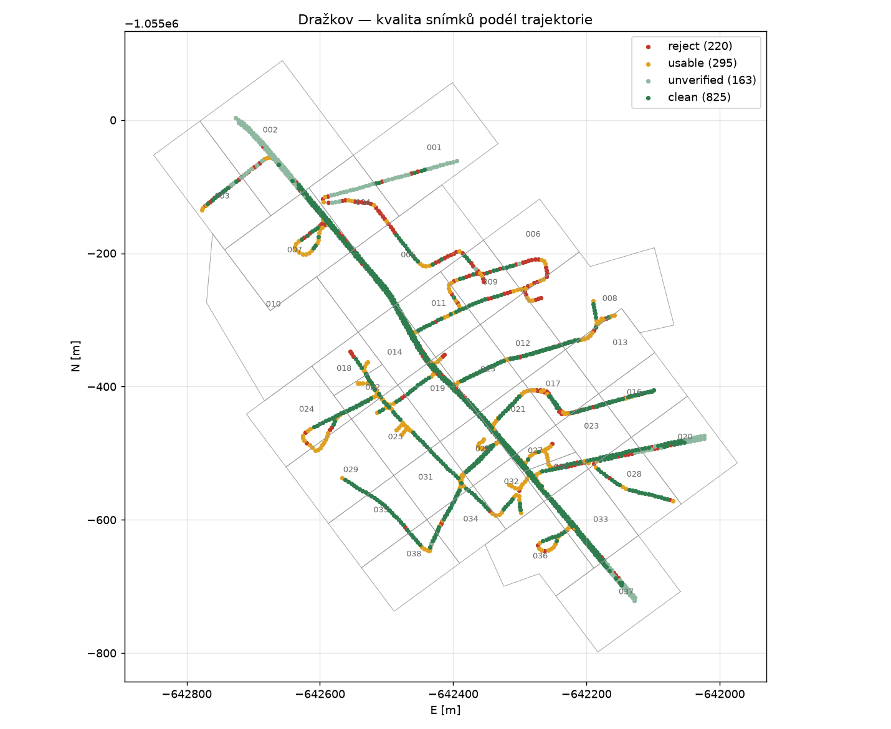
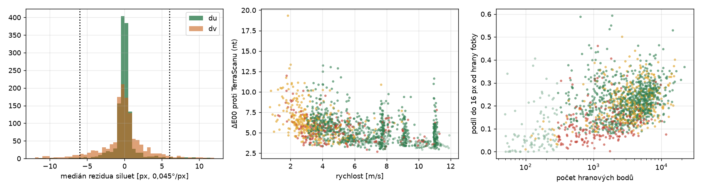

# Čistý dataset Dražkov — snímky ověřeně zarovnané s mračnem

Výběr podmnožiny panoramat (a k nim náležejících bodů), u kterých je zarovnání s mračnem **nezávisle ověřené** a póza dobře podmíněná, pro další práci: pseudo-GT pro segmentaci, přenos značek 2D→3D, fúzi barev, kalibrační experimenty. Definice je objektivní (kritéria níže), reprodukovatelná (`uv run python -m mapping.quality`) a verzovaná v `dataset/`.

## 1. Proč ne podle ΔE

Řazení snímků podle barevné shody s referenčním RGB TerraScanu (`02 §13.6`) vybírá **volbu zdrojového snímku v TerraScanu**, ne geometrii: pomalé snímky v otočkách mají ΔE 10–19, přestože siluety mračna leží na hranách fotky do 2 px. Kritériem zarovnání je proto geometrie: **hloubkové/oblohové siluety mračna vůči nejbližší hraně fotografie**, počítané jen z bodů téhož průjezdu.

## 2. Kritéria (`mapping/quality.py`)

Pro každý z 1 503 snímků:

| veličina | výpočet | práh |
|---|---|---|
| `du`, `dv` | medián posunu bodů siluet (jemný z-buffer 4000×2000, výběr podle vlastní buňky) k nejbližší hraně fotky (distanční transformace, potlačené texturované plochy), plné rozlišení, 1 px = 0,045° | \|du\|, \|dv\| ≤ **6 px** (0,27° ≈ 5 cm v 10 m) |
| `du_mad`, `dv_mad` | MAD téhož rezidua | ≤ 16 px |
| `inlier8` | podíl bodů siluet do 16 px od hrany fotky | ≥ 0,08 |
| `n_edge` | počet bodů siluet | ≥ 300 (jinak *unverified*) |
| `pass_conflict` | totéž reziduum pro body **sousedního průjezdu** v okně ±45 s; \|du\| nebo \|dv\| > 8 px = průjezdy se v obraze rozcházejí | nesmí nastat |
| `speed`, `yaw_rate` | z trajektorie (yaw rate centrální diference v průjezdu) | ≥ 3 m/s, ≤ 5°/s |
| `sharpness` | rozptyl Laplaciánu (2000×1000, pás −35…+30°) | ≥ 40 (žádný snímek nepropadl; rozsah 156–856) |
| `de_nt` | medián ΔE00 proti TerraScanu z běhu `tw45` | jen informativní |

Prahy geometrie jsou nastavené na šum metody: u dobře zarovnaných snímků kolísá per-snímkový medián s MAD ≈ 11 px (hrany vegetace, poslední odraz lidaru vs. silueta ve fotce) a snímky za hranicí 4 px mají stejnou barevnou shodu jako snímky pod ní (ΔE 4,7 vs 5,0). 6 px je tedy tolerance, ne detekce.

Třídy:

- **clean** — geometrie ověřená, bez konfliktu průjezdů, rychlost ≥ 3 m/s a yaw rate ≤ 5°/s, ostrý. *Bezpečné pro všechno včetně fúze napříč snímky téhož průjezdu.*
- **unverified** — méně než 300 bodů siluet (otevřené pole, žádná struktura k ověření), pohyb bezproblémový. *Geometricky pravděpodobně v pořádku (ΔE medián 3,8 — nejlepší ze všech), jen to nelze doložit; vhodné pro zemní třídy.*
- **usable** — geometrie ověřená, ale pomalý/točící se snímek nebo konflikt průjezdů. *Jednosnímkové použití ano; fúze napříč průjezdy ne.*
- **reject** — reziduum siluet mimo toleranci (medián \|dv\| 6,6 px, MAD 13,5) nebo málo hran a špatný pohyb.

## 3. Výsledek

| třída | snímků | rychlost (med) | yaw rate (med) | \|du\| / \|dv\| med [px] | MAD [px] | inlier | ΔE00 nt (med) |
|---|---|---|---|---|---|---|---|
| clean | **825** | 7,2 m/s | 0,5°/s | 0,38 / 0,78 | 8,1 / 11,2 | 0,22 | 5,0 |
| unverified | 163 | 9,1 | 0,3 | (2,6 / 7,3 z ≤ 70 bodů) | – | – | 3,8 |
| usable | 295 | 3,1 | 9,4 | 0,37 / 0,88 | 7,9 / 11,1 | 0,20 | 6,1 |
| reject | 220 | 4,6 | 1,1 | 0,63 / 6,57 | 8,0 / 13,5 | 0,11 | 5,1 |

U třídy *clean* je P90 \|du\| = 1,5 px a P90 \|dv\| = 3,4 px (0,15°); pokrývá 26 z 30 průjezdů. Důvody vyřazení (snímek může mít víc): otočka 279×, geometrie 220×, pomalá jízda 183×, málo hran 178×, konflikt průjezdů 26× (průjezdy 4, 5, 7, 9, 11, 13, 15, 16, 26 — vždy okraje otoček).

Průjezdy s nejhorší bilancí: **12** (143 snímků, 28 clean, 56 reject — severovýchodní smyčka přes dlaždice 004–009 včetně okrajových 001, 006, 008), 13 a 14 (severozápad, dlaždice 002, 003, 007), 15. Průjezdy 0, 1, 23–27 (hlavní ulice a jižní část) jsou téměř celé čisté.





### Dlaždice

`dataset/tile_summary.json`: pro každou dlaždici počet snímků s kamerou do 20 m od jejího bboxu po třídách. **29 z 38 dlaždic** má ≥ 60 % snímků clean + unverified: 002–005, 007, 010, 011, 013–017, 019–021, 023, 025–028, 030–038. Slabé dlaždice (více reject než clean): **001, 006, 009** (okraje obce, průjezdy 12–14) — používat jen s filtrem podle snímků.

## 4. Jak dataset používat

Soubory (verzované kopie v `dataset/`, originály v `Geovap_cache/out/dataset/`):

- `frame_quality.csv` — 1 503 řádků, všechny veličiny + `cls` + `reasons`.
- `clean_frames.json` — seznamy indexů snímků po třídách (index = pořadí v čase = `mapping.poses.load_poses()`), použité prahy.
- `tile_summary.json` — bilance po dlaždicích.

Typické použití:

```python
import json
from mapping.poses import load_poses
from mapping.frame_select import FrameIndex
sel = json.load(open("dataset/clean_frames.json"))
frames = set(sel["clean"]) | set(sel["unverified"])      # 988 snímků
poses = load_poses(); fi = FrameIndex(poses)
# pseudo-GT / render jen z čistých snímků:
#   uv run python -m mapping.cli.render_frame <k> --jvf --overlay      pro k in frames
# obarvení / hlasování o třídách: v mapping.colorize omezit `frames` na tuto množinu
#   (Options zatím nemá filtr snímků – přidat `frame_whitelist`), nebo body filtrovat podle src_image.
```

Doporučení:

1. **Trénovací/pseudo-GT snímky**: `clean` (+ `unverified` pro zemní třídy). Vyhnout se `reject` úplně.
2. **Fúze přes více snímků**: jen v rámci jednoho průjezdu, nebo mezi průjezdy bez `pass_conflict` — průjezdy nejsou všude vzájemně registrované (`02 §13.6`).
3. **Vzdálenost**: přesnost projekce je 0,15–0,3° (P90 u clean), tj. 3–5 cm v 10 m, 13–20 cm ve 40 m. Pro 14 cm rozpočet používat body do ~25 m od kamery.
4. **Body**: „čistý bod" = bod, jehož nejbližší snímek v čase je `clean`/`unverified` (`nt_frame` v `colorize.py`, `src_image` ve výstupním LAZ). Tím vzniká podmnožina mračna konzistentní s výběrem snímků.

## 5. Reprodukce

```
uv run python -m mapping.quality 4 350     # 4 procesy, 350 snímků na běh (přírůstkově, JSONL), opakovat
uv run python -c "from mapping.quality import reclassify; reclassify()"   # přepočet tříd po změně prahů
```

Poznámka k prostředí: sledování paměti hlídačem úloh počítá stránky memmapovaného store do RSS každého procesu; `CloudStore.release()` (po každém snímku) a `drop_cache()` to řeší, přesto běhy nad ~10 min v pozadí bývají ukončeny — proto po částech.
