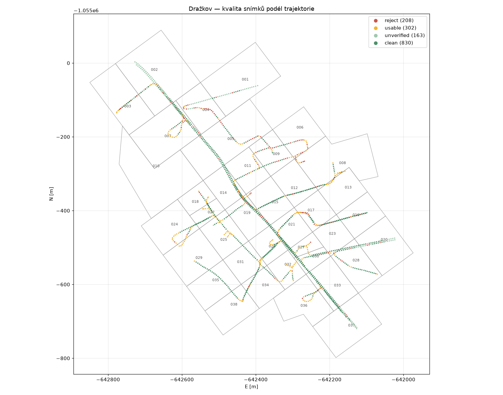
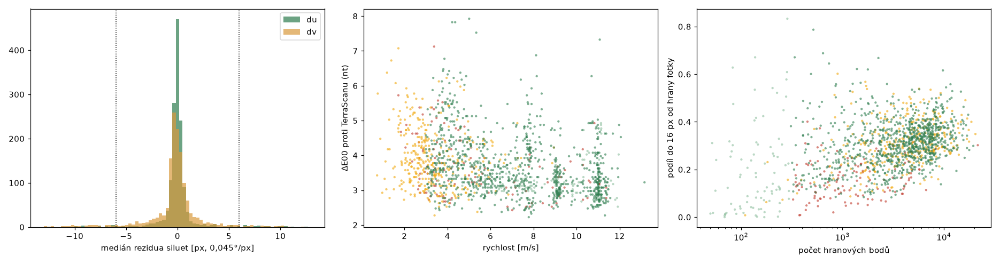

# Čistý dataset Dražkov — snímky ověřeně zarovnané s mračnem

Výběr podmnožiny panoramat (a k nim náležejících bodů), u kterých je zarovnání s mračnem **nezávisle ověřené** a póza dobře podmíněná, pro další práci: pseudo-GT pro segmentaci, přenos značek 2D→3D, fúzi barev, kalibrační experimenty. Definice je objektivní (kritéria níže), reprodukovatelná (`uv run python -m mapping.quality`) a verzovaná v `dataset/`.

## 1. Proč ne podle ΔE

Řazení snímků podle barevné shody s referenčním RGB TerraScanu (`02 §13.6`) vybírá **volbu zdrojového snímku v TerraScanu**, ne geometrii: pomalé snímky v otočkách mají ΔE 10–19, přestože siluety mračna leží na hranách fotky do 2 px. Kritériem zarovnání je proto geometrie: **hloubkové/oblohové siluety mračna vůči nejbližší hraně fotografie**, počítané jen z bodů téhož průjezdu.

## 2. Kritéria (`mapping/quality.py`)

Pro každý z 1 503 snímků:

| veličina | výpočet | práh |
|---|---|---|
| `du`, `dv` | medián posunu bodů siluet (jemný z-buffer 4000×2000, výběr podle vlastní buňky) k nejbližší hraně fotky (distanční transformace, potlačené texturované plochy), plné rozlišení, 1 px = 0,045° | \|du\|, \|dv\| ≤ **6 px** (0,27° ≈ 5 cm v 10 m) |
| `du_mad`, `dv_mad` | MAD téhož rezidua | ≤ 16 px |
| `inlier8` | podíl bodů siluet do 16 px od hrany fotky | ≥ 0,08 |
| `n_edge` | počet bodů siluet | ≥ 300 (jinak *unverified*) |
| `pass_conflict` | totéž reziduum pro body **sousedního průjezdu** v okně ±45 s; \|du\| nebo \|dv\| > 8 px = průjezdy se v obraze rozcházejí | nesmí nastat |
| `speed`, `yaw_rate` | z trajektorie (yaw rate centrální diference v průjezdu) | ≥ 3 m/s, ≤ 5°/s |
| `sharpness` | rozptyl Laplaciánu (2000×1000, pás −35…+30°) | ≥ 40 (žádný snímek nepropadl; rozsah 156–856) |
| `de_nt` | medián ΔE00 proti TerraScanu z běhu `tw45` | jen informativní |

Prahy geometrie jsou nastavené na šum metody: u dobře zarovnaných snímků kolísá per-snímkový medián s MAD ≈ 11 px (hrany vegetace, poslední odraz lidaru vs. silueta ve fotce) a snímky za hranicí 4 px mají stejnou barevnou shodu jako snímky pod ní (ΔE 4,7 vs 5,0). 6 px je tedy tolerance, ne detekce.

Třídy:

- **clean** — geometrie ověřená, bez konfliktu průjezdů, rychlost ≥ 3 m/s a yaw rate ≤ 5°/s, ostrý. *Bezpečné pro všechno včetně fúze napříč snímky téhož průjezdu.*
- **unverified** — méně než 300 bodů siluet (otevřené pole, žádná struktura k ověření), pohyb bezproblémový. *Geometricky pravděpodobně v pořádku (ΔE medián 3,8 — nejlepší ze všech), jen to nelze doložit; vhodné pro zemní třídy.*
- **usable** — geometrie ověřená, ale pomalý/točící se snímek nebo konflikt průjezdů. *Jednosnímkové použití ano; fúze napříč průjezdy ne.*
- **reject** — reziduum siluet mimo toleranci (medián \|dv\| 6,6 px, MAD 13,5) nebo málo hran a špatný pohyb.

## 3. Výsledek

| třída | snímků | rychlost (med) | yaw rate (med) | \|du\| / \|dv\| med [px] | MAD [px] | inlier | ΔE00 nt (med) |
|---|---|---|---|---|---|---|---|
| clean | **825** | 7,2 m/s | 0,5°/s | 0,38 / 0,78 | 8,1 / 11,2 | 0,22 | 5,0 |
| unverified | 163 | 9,1 | 0,3 | (2,6 / 7,3 z ≤ 70 bodů) | – | – | 3,8 |
| usable | 295 | 3,1 | 9,4 | 0,37 / 0,88 | 7,9 / 11,1 | 0,20 | 6,1 |
| reject | 220 | 4,6 | 1,1 | 0,63 / 6,57 | 8,0 / 13,5 | 0,11 | 5,1 |

U třídy *clean* je P90 \|du\| = 1,5 px a P90 \|dv\| = 3,4 px (0,15°); pokrývá 26 z 30 průjezdů. Důvody vyřazení (snímek může mít víc): otočka 279×, geometrie 220×, pomalá jízda 183×, málo hran 178×, konflikt průjezdů 26× (průjezdy 4, 5, 7, 9, 11, 13, 15, 16, 26 — vždy okraje otoček).

Průjezdy s nejhorší bilancí: **12** (143 snímků, 28 clean, 56 reject — severovýchodní smyčka přes dlaždice 004–009 včetně okrajových 001, 006, 008), 13 a 14 (severozápad, dlaždice 002, 003, 007), 15. Průjezdy 0, 1, 23–27 (hlavní ulice a jižní část) jsou téměř celé čisté.





### Dlaždice

`dataset/tile_summary.json`: pro každou dlaždici počet snímků s kamerou do 20 m od jejího bboxu po třídách. **29 z 38 dlaždic** má ≥ 60 % snímků clean + unverified: 002–005, 007, 010, 011, 013–017, 019–021, 023, 025–028, 030–038. Slabé dlaždice (více reject než clean): **001, 006, 009** (okraje obce, průjezdy 12–14) — používat jen s filtrem podle snímků.

## 4. Jak dataset používat

Soubory (verzované kopie v `dataset/`, originály v `Geovap_cache/out/dataset/`):

- `frame_quality.csv` — 1 503 řádků, všechny veličiny + `cls` + `reasons`.
- `clean_frames.json` — seznamy indexů snímků po třídách (index = pořadí v čase = `mapping.poses.load_poses()`), použité prahy.
- `tile_summary.json` — bilance po dlaždicích.

Typické použití:

```python
import json
from mapping.poses import load_poses
from mapping.frame_select import FrameIndex
sel = json.load(open("dataset/clean_frames.json"))
frames = set(sel["clean"]) | set(sel["unverified"])      # 988 snímků
poses = load_poses(); fi = FrameIndex(poses)
# pseudo-GT / render jen z čistých snímků:
#   uv run python -m mapping.cli.render_frame <k> --jvf --overlay      pro k in frames
# obarvení / hlasování o třídách: v mapping.colorize omezit `frames` na tuto množinu
#   (Options zatím nemá filtr snímků – přidat `frame_whitelist`), nebo body filtrovat podle src_image.
```

Doporučení:

1. **Trénovací/pseudo-GT snímky**: `clean` (+ `unverified` pro zemní třídy). Vyhnout se `reject` úplně.
2. **Fúze přes více snímků**: jen v rámci jednoho průjezdu, nebo mezi průjezdy bez `pass_conflict` — průjezdy nejsou všude vzájemně registrované (`02 §13.6`).
3. **Vzdálenost**: přesnost projekce je 0,15–0,3° (P90 u clean), tj. 3–5 cm v 10 m, 13–20 cm ve 40 m. Pro 14 cm rozpočet používat body do ~25 m od kamery.
4. **Body**: „čistý bod" = bod, jehož nejbližší snímek v čase je `clean`/`unverified` (`nt_frame` v `colorize.py`, `src_image` ve výstupním LAZ). Tím vzniká podmnožina mračna konzistentní s výběrem snímků.

## 5. Aktualizace na korigované pozice

`mapping/quality.py` je od `08_korekce_poz_panoramat.md` parametrizované pózou (`poses_source`
argument / env `GEOVAP_POSES`, viz `08 §2.4`): `run()`/`reclassify()` bez argumentu čtou/píšou přesně
tam, kam dnes (`Geovap_cache/out/dataset/` — regresní kotva, beze změny), `GEOVAP_POSES=corrected`
píše do `Geovap_cache/out/dataset_e8f3e1/` (`mapping.config.source_dir`, stejný vzor jako
`products.frames_dir` v `08 §2.5` — hash-suffixovaný sourozenec, nikdy přepis exportu). `open_store`
uvnitř `assess_frame` bere registraci automaticky z `poses_corrected.json` (`registration` pole),
takže korigovaný běh není potřeba nijak zvlášť míchat s `CloudStore(registration=...)` — stačí
`GEOVAP_POSES=corrected`.

```
GEOVAP_POSES=corrected uv run python -m mapping.quality 8 350   # 8 procesů, přírůstkově do dataset_e8f3e1/
GEOVAP_POSES=corrected uv run python -c "from mapping.quality import reclassify; reclassify()"
```

Celý běh (1 503/1 503 snímků, dokončeno) proti stejnému `export.csv`-founded `frame_quality.csv` v
`dataset/export_baseline/` (regresní referenční bod, `dataset/README.md`):

| třída | export | corrected | Δ | \|du\| med [px] (exp→cor) | \|dv\| med [px] (exp→cor) | MAD du/dv (exp→cor) | inlier (exp→cor) |
|---|---:|---:|---:|---|---|---|---|
| clean | 825 | **830** | +5 | 0,38→0,31 | 0,78→0,74 | 8,10/11,17 → 7,75/10,84 | 0,221→0,231 |
| unverified | 163 | 163 | 0 | 2,55→2,00 | 7,31→5,61 | 6,54/10,46 → 7,08/10,68 | 0,063→0,069 |
| usable | 295 | **302** | +7 | 0,37→0,33 | 0,88→0,79 | 7,94/11,14 → 7,65/11,05 | 0,202→0,214 |
| reject | 220 | **208** | −12 | 0,63→0,62 | 6,57→6,29 | 8,03/13,46 → 8,57/13,50 | 0,113→0,111 |

`de_nt` (informativní barevná ΔE00) je v mezích zaokrouhlení beze změny ve všech třídách (clean
5,03→5,03) — konzistentní se zjištěním `08 §1`, že tahle metrika sleduje volbu zdrojového snímku v
TerraScanu, ne pózu. `clean` P90 \|du\| 1,46→**1,07 px**, P90 \|dv\| 3,44→**3,07 px** (obojí lepší);
pokrytí zůstává 26 z 30 průjezdů (stejné dva scházející jako u exportu). Konflikty průjezdů (\|du\|
nebo \|dv\| > 8 px vůči sousednímu průjezdu) klesly 26→**23** snímků, ale ne beze zbytku na stejných
místech: průjezdy 4, 5, 7, 9, 11, 13, 15, 16, 26 mají konflikt v obou bězích, korigovaný běh navíc
nově vlajkuje pár snímků v průjezdech **17 a 20** (dřív bez konfliktu) — čistý posun k lepšímu, ne
jednosměrné vymizení. Důvody vyřazení/omezení (snímek může mít víc, počty přes celý dataset, ne jen
`reject`): otočka 279× (beze změny), geometrie 220→**208**×, pomalá jízda 183→188× (+5, mírně hůř),
málo hran 178→176× (−2), konflikt průjezdů 26→23×.

**Kolik snímků změnilo třídu**: 99 z 1 503 (6,6 %) — ne jen posun v okolí prahu jedním směrem.
Největší přesun je `reject → clean` (31 snímků) proti `clean → reject` (27) — čistě +4 ve prospěch
`clean`, zbytek rozdílu (825→830 = +5) jde přes `usable`/`unverified`. Další velké skupiny:
`reject → usable` (15) vs. `usable → reject` (9), `clean → usable` (5) vs. `usable → clean` (4). Jde
tedy o skutečné překlápění jednotlivých snímků na obě strany prahu (geometrie posunutá o zlomek
pixelu u snímků, které už byly blízko `6 px`/`16 px MAD`/`0,08 inlier` hranice), ne o jednosměrné
zlepšení celé populace.

Rozdělení podle průjezdu potvrzuje `07`/`04 §3` diagnózu nejhorších průjezdů beze změny: 12 (28→**31**
clean z 56→**53** reject, pořád nejhorší bilance), 13 (4 clean, 12 reject, beze změny), 14 (23→**26**
clean, 22→20 reject) — severovýchodní/severozápadní smyčka zůstává nejslabším místem datasetu i po
korekci pózy, jen o pár snímků méně vyhrocená. Naopak průjezdy 0, 1, 23–25, 27, které byly v exportu
téměř celé čisté, jsou po korekci prakticky beze změny (0: 132→134, 1: 140→**135**, mírně hůř; 23:
35→**33**, 24: 30→**31**, 25: 38→38, 27: 29→**28**) — korekce se soustředila do stejných problémových
smyček, ne do už dobrých úseků. `tile_summary.json` (bilance po dlaždicích, `§3`) má teď generátor
(`mapping.quality.write_tile_summary`/`plot_quality`, CLI `uv run python -m mapping.quality
tile-summary <csv> <out_dir> --poses {export,corrected}`) — zrekonstruovaný z ad hoc skriptu, ověřený
proti dosavadnímu `dataset/export_baseline/tile_summary.json` na téže (export) tabulce: **17 z 38
dlaždic přesná shoda**, zbytek se liší o pár snímků na dlaždici (bbox-distance zaokrouhlení na
hranicích dlaždic, ne chyba generátoru — stejná hranice jako u původního ad hoc skriptu). Dnešní
`dataset/tile_summary.json` je z korigovaného běhu (830 clean).

**Verdikt**: korekce pózy čistý dataset mírně zlepšila, ne dramaticky a ne bezezbytku. `clean` +5
snímků (0,6 %), `reject` −12 (−5,5 %), geometrická reziduua (\|du\|, \|dv\|, MAD, inlier) se zlepšila
napříč všemi čtyřmi třídami současně (i u `reject` a `usable`, ne jen `clean`) — konzistentní s `08
§1` zjištěním, že hlavní přínos korekce je oprava mezisnímkové interpolace v zatáčkách, kde `quality.py`
taky měří (siluety vůči hraně fotky). Nejhorší průjezdy (12, 13, 14) zůstávají nejhoršími i po
korekci — korekce posouvá hranici o pixely, neřeší tam strukturální problém (viz `08 §3.4`
azimutálně strukturované reziduum, které žádná tuhá póza jednoho snímku nevysvětlí).

**Promoce (od této aktualizace)**: `dataset/clean_frames.json` (použité v `mapping/README.md`,
`seg/render_labels.py` atd.) je **promotované na korigované pózy** — kopie
`Geovap_cache/out/dataset_e8f3e1/{frame_quality.csv,clean_frames.json}`, produkční množina je teď
830/163/302/208. Export klasifikace (825/163/295/220) je uložená v `dataset/export_baseline/` jako
regresní referenční bod, ne živá data; kdo ji potřebuje explicitně, čte odtud. Přechod se netýká jen
klasifikace: `825→830 clean` je turnover 32 vypadlých + 37 nových snímků (793 společných), ne prostý
přírůstek pěti — viz `dataset/README.md` pro rozpad podle průjezdu a dopad na segmentační dataset
(`Geovap_cache/segds_e8f3e1/`, přestavěný na tuto novou množinu).

## 6. Reprodukce

```
uv run python -m mapping.quality 4 350     # 4 procesy, 350 snímků na běh (přírůstkově, JSONL), opakovat
uv run python -c "from mapping.quality import reclassify; reclassify()"   # přepočet tříd po změně prahů
```

Poznámka k prostředí: sledování paměti hlídačem úloh počítá stránky memmapovaného store do RSS každého procesu; `CloudStore.release()` (po každém snímku) a `drop_cache()` to řeší, přesto běhy nad ~10 min v pozadí bývají ukončeny — proto po částech.
